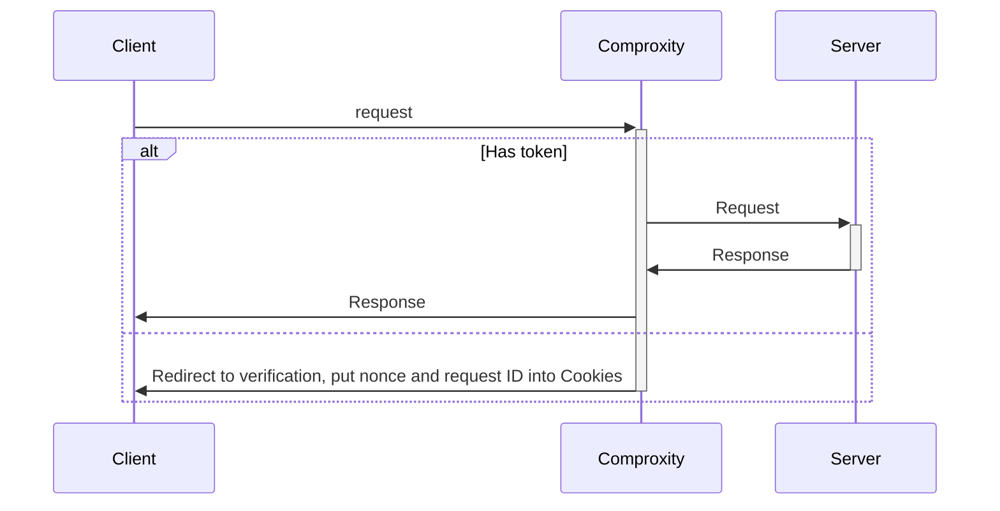
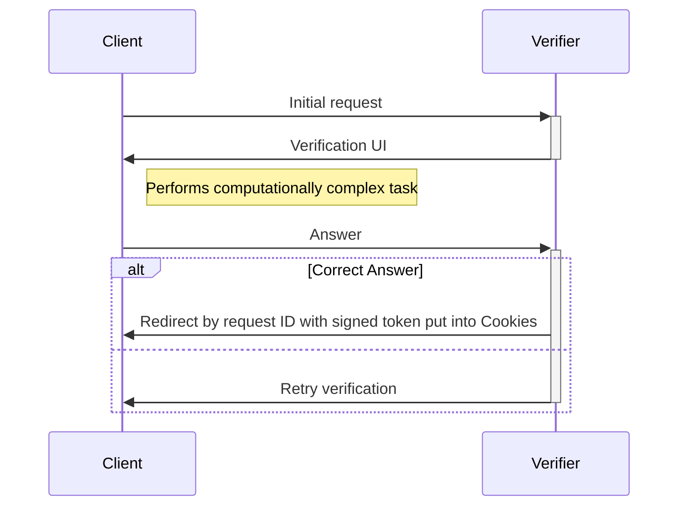

# comproxity

Simple Proof of Work (PoW) HTTP proxy

# Algorithm

Request attempt:

```mermaid
sequenceDiagram
    Client ->>+ Comproxity: request
    alt Has token
        Comproxity ->>+ Server: Request
        Server ->>- Comproxity: Response
        Comproxity ->> Client: Response
    else
        Comproxity ->>- Client: Redirect to verification, put nonce and request ID into Cookies
    end
```

Verification process:

```mermaid
sequenceDiagram
    Client ->>+ Verifier: Initial request
    Verifier ->>- Client: Verification UI
    Note right of Client: Performs computationally complex task
    Client ->>+ Verifier: Answer
    alt Correct Answer
        Verifier ->> Client: Redirect by request ID with signed token put into Cookies
    else
        Verifier ->>- Client: Retry verification
    end
```
